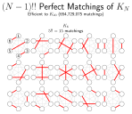

## README (perfect-matchings-of-a-complete-graph)

[](https://github.com/danielrherber/perfect-matchings-of-a-complete-graph/releases/latest)
[](https://www.mathworks.com/products/matlab.html)
[](https://github.com/danielrherber/perfect-matchings-of-a-complete-graph/issues)
[](https://github.com/danielrherber/perfect-matchings-of-a-complete-graph/graphs/contributors)

[](https://github.com/danielrherber/perfect-matchings-of-a-complete-graph/blob/master/License)

Recursive algorithm for the (N-1)!! perfect matchings of Kn and incomplete listings for large N.



---
### Install
* Download the [project files](https://github.com/danielrherber/perfect-matchings-of-a-complete-graph/archive/master.zip)
* Run [INSTALL_PM.m](https://github.com/danielrherber/perfect-matchings-of-a-complete-graph/blob/master/INSTALL_PM.m) in the MATLAB Command Window 
(*automatically adds project files to your MATLAB path and opens an example*)
```matlab
INSTALL_PM
```
* See [PM_verify.m](https://github.com/danielrherber/perfect-matchings-of-a-complete-graph/blob/master/examples/PM_verify.m) for examples
```matlab
open PM_verify
```

---
### Overview

This submission provides an efficient recursive algorithm for enumeration the (N-1)!! perfect matchings (or 1-factors) of complete graph (Kn). Perfect matchings are only possible on graphs with an even number of vertices so N must be even. The algorithm leverages previously found perfect matchings for smaller complete graphs to build up the perfect matchings for a larger Kn. Please see the image above for a visualization of the perfect matchings for K6.

The current practical limit on N is 20 since N=22 would require 210.8 Gb of RAM (see table below). Perhaps a more memory efficient implementation (noting that the uint8 class is used already) would allow for K22 since the predicted MAT file size of the result is 5217 Mb.
```
 N      (N-1)!!   CPU Time  Max Memory   MAT Size 
 8          105    0.00041           -          - 
10          945    0.00067           -          - 
12        10395    0.00130           -          - 
14       135135    0.00669      2.1 Mb   328.0 Kb 
16      2027025    0.16698     38.3 Mb   968.0 Kb 
18     34459425    3.32852      0.6 Gb    17.3 Mb 
20    654729075   80.39450     13.5 Gb   346.9 Mb 
22  13749310575         -    210.8 Gb* 5217.6 Mb*     *predicted size
```

A secondary function is `PM_index2pm` which allows for a list of numbers between 1 and (N-1)!! and returns the perfect matching entries that would occur in the matrix result from `PM_perfectMatchings`. This allows for perfect matching entries for N > 20 but a complete list still impractical due to the aforementioned limitations. 

The inverse function of `PM_index2pm` is provided with `PM_pm2index`. Given a row vector that represents a perfect matching, return the corresponding perfect matching number in the enumerated list.

#### References
* Reference on perfect matchings: [[link]](http://mathworld.wolfram.com/PerfectMatching.html)
* Mathematica code-based discussion (my approach is much more efficient since it is not using any filtering, Michael Hale's answer also uses recursion) [[link]](http://mathematica.stackexchange.com/questions/44166)
* Discussion on the number of perfect matchings in complete graphs [[link]](http://math.stackexchange.com/questions/60894)
* Double factorial function [[link]](https://en.wikipedia.org/wiki/Double_factorial) (see first application) and [[link]](http://mathworld.wolfram.com/DoubleFactorial.html)

---
### General Information

#### Contributors
* [Daniel R. Herber](https://github.com/danielrherber)

#### Project Links
* [https://github.com/danielrherber/perfect-matchings-of-a-complete-graph](https://github.com/danielrherber/perfect-matchings-of-a-complete-graph)
* [http://www.mathworks.com/matlabcentral/fileexchange/52301](http://www.mathworks.com/matlabcentral/fileexchange/52301)